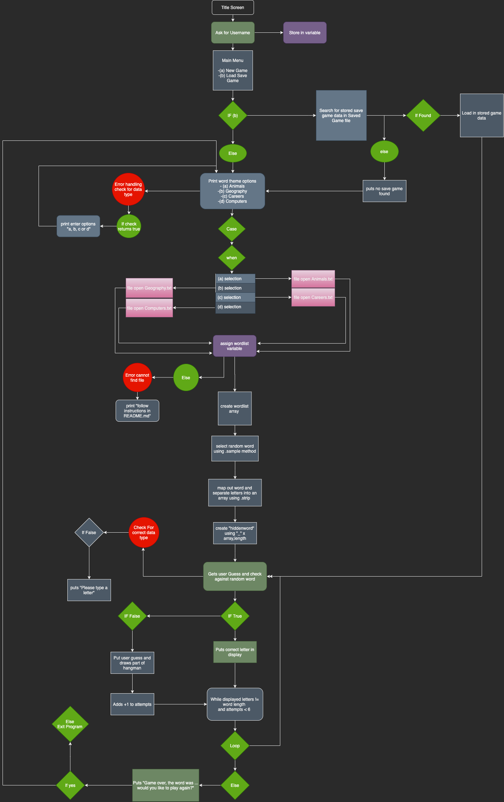

#### GitHub Source 

https://github.com/KeiranHoward/Hangman

# Software Development Plan

### **Describe** at a high level what the application will do

---

The software I am designing is a game of hangman. The application will offer the user options to select which theme they would like to play. Once the user has selected the word theme, the application will then randomly import a word from an external text document and separate the word into individual letters. If the user guesses a letter correctly the letter will then be displayed on the screen. If the user guesses a letter incorrectly the application will add 1 to user attempts, print a section of a hangman ascii image and print the incorrectly guess letter in an array. If the user guesses all letters correctly the application will print "You Won!" and then ask if they would like to play again. If the user selects "yes" the application will run again, if they select "no" the application will exit. Alternatively if the user runs out of attempts the words "You Loss" will print along with the hidden word. They will then be presented with the play again option. 

The application will utilize multiple gems to enable both decorative and functional features. The save and load game features will use JSON to store and retrieve data from an external JSON file. The application will then send the word, guesses and attempts from the current game instance to the JSON file.

### **Identify** the problem it will solve and **explain** why you are developing it

---

The application will the widespread problem of boredom whilst still being educational. I am developing this program as I believe it will be a fun project to test my newly learnt skills using the Ruby programming language. There are aspects of this application which will require me to research technologies which have not been covered in class. I believe this project will be a challenge at times but will solidify my current knowledge in programming.

### **Identify** the target audience

---

This application is mostly targeted towards high school students as some words may be too complex for a younger audience to spell. The word theme select feature will also allow users to pick a topic which they are interested in hopefully making the game more enjoyable. 

### Explain how a member of the target audience will use it

----

The user will first be presented with a title screen which will ask for the user to "hit enter to continue". They will then be given the option to start a new game or load a saved game. If the user selects load game, the game instance will resume from last save. If the user selects new game they will then get to choose between a selection of word themes.

The application will then print out underscores equal to the words length and receive a prompt to type a letter.

If the letter is not in the word, the application will print out last guess as well as an ascii image of a hang which progresses incrementally. Once the word is correctly guessed or the user runs out of turns they will be given the option to start a new game or exit.

### Describe three features 

---

Word Theme Selection:

The application will have 4 separate ruby files each containing an array of strings representing a common theme. The user will be given a option upon a new game whereas they can select which theme or wordlist the word will be randomly selected from.

Save Game:

The application will have an option which will save the current instance of your game and store it in a separate file. This can then be called using an option. The saved file data will be stored using a Ruby gem which will allow for a save and load function. 

Ascii hangman:

When the user makes an incorrect letter attempt a component of a hang man image will be printed to the screen. Each time a wrong letter is added the hangman parts will be added incrementally. 

### Flow Control Diagram

---

###  

### **Develop **an implementation plan which

---

https://trello.com/b/Djx97Z8M/ruby-terminal-project

### **Design** help documentation

---

Installation:

For Mac and Linux:

​	To install game run hangman.exe

For Windows

​	Install Ruby found here  - https://www.ruby-lang.org/en/downloads/

​	Use bash shell terminal, follow these instructions to run a Linux shell on 	windows 10 -  https://itsfoss.com/install-bash-on-windows/#:~:text=Bash%20on%20Windows%20provides%20a,that%20you%20find%20on%20Linux.

Do not move file location as file loads in relative documents

Game dependencies: 

 "rspec", "~> 3.9"

"colorize", "~> 0.8.1"

"tty-prompt", "~> 0.22.0"

"json", "~> 2.3"

"jbuilder", "~> 2.10"

"powerpack", "~> 0.1.2"

